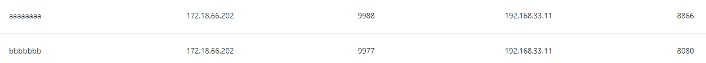

NAS
http://10.60.6.30:5000/
ecs_scm
ecs123456

* HC sftp
172.18.71.146
sftpuser/123456
faca/123456

* NH sftp
10.60.6.21
faca/123456

* file server sftp
10.36.94.194
ecs_scm/ecs123456
user/1234(56)
檔案路徑 /mnt/FACASHARE/1063/
net use x: http://10.36.94.194:5000 /user:nick.cheng 12345678

##### Face++
* 2.1
aptg_hq@perobot.com.tw
123456
admin@foxconn.com
perobot
---
* 2.9
face@aptg.com.tw
123456
* root帳密
admin@megvii.com
123456
nnadmin@foxconn.com
123456
---
* 3.1
admin@megvii.com
admin@foxconn.com
faca123456
user/aptg123456
---
* 內湖
http://10.60.3.12
admin@foxconn.com
perobot
* remote ssh
10.60.3.12:222 user/1234
* root帳密
admin@megvii.com
perobot
* rtsp stream
rtsp://10.60.6.28:8554/CH002.sdp
rtsp://10.60.6.28:8554/CH001.sdp
---
* 新竹
http://172.18.32.226
admin@foxconn.com
perobot
* root帳密
admin@megvii.com
perobot
* remote ssh
10.36.91.110 faca/123456
docker vm: ssh user@172.18.32.226 -p 2222
face++: ssh user@192.168.0.11
* rtsp stream
rtsp://172.18.71.25:8554/CH001.sdp

10.60.6.175
faca
123456

10.36.94.120
faca
123456
---
* 越南
10.224.69.126
foxconn/foxcoonn168!!
ssh user@192.168.0.13
aptg123456

192.168.0.11
qvoadmin@foxconn.com
qvoadmin123456

* 龍華
http://10.132.56.60
face@aptg.com.tw
perobot
ssh user@10.132.56.60 -p 2222
* root帳密
admin@megvii.com
123456
---
* SQA
2680
port forwarding: 172.18.66.199
host: 172.18.66.74
docker: 192.168.0.42
face++: 192.168.0.40
2630
port forwarding: 172.18.66.200
host: 172.18.66.149
docker: 192.168.33.12
face++: 192.168.33.11
http://172.18.66.149:5060/#/base

* 2ccnp
host
172.18.66.117
user/123456

web_frontend
172.18.66.202
8888
host=192.168.33.11:9000&group=All

http://172.18.66.199:8800/settings/network

---
smb poc
10.60.6.27
user/123456
10.60.6.29
---
[portal](http://10.36.94.107:6200/)

[SmartOffice](http://tw.smartoffice.efoxconn.com)
http://172.18.67.117/foxconn/logon.aspx

vdi
可以透過這個網頁去修改密碼
https://hcvdi.hc.cloudnsbg.efoxconn.com/RDWeb/Pages/zh-TW/login.aspx
HC\831392
Ab123523618

google doc for SI team
https://drive.google.com/drive/u/1/folders/0AEykEN03RZNCUk9PVA

email
nick.yc.cheng@mail.foxconn.com
nick.yc.cheng@fii-foxconn.com
nick.yc.cheng/Ab123456

Notes
IBM Lotus Notes: 46725306
二次密碼: Td62447&

A System 二次登入的密碼, 最新資訊如下:
第一次登入:
帳號:CNSBG-TW-NOTES-FACA
密碼:Qp42936?

第二次登入:
帳號:您的工號
密碼:您二次登入的密碼

員工福利網
http://welfare.efoxconn.com/iwelfare/s/index
831392/A123456

TWHR員工入口網
http://twemp.efoxconn.com
831392/Ab123456

財會協同作業平台
http://fsso.efoxconn.com/
831392/Ab123456

112電子作業系統
http://112.efoxconn.com/home/index
831392 
123456

Mantis
https://172.18.223.170/mec/login_page.php
https://mantis.cnsbg.foxconn.com/mec/login_page.php?return=%2Fmec%2Fmain_page.php
831392
123456

Mantis
http://10.36.94.108:8989/my_view_page.php
nick
Ab123456

git
http://10.36.94.101/users/sign_in
nick/Ab123456
root/faca123456
ecs_scm/ecs88888888

禪道
http://10.36.94.194:2222
nick.cheng
12345678$

BBU build server
ssh root@10.36.91.174
123456

remote chrome
831392
Ab123523618

google document
https://drive.google.com/drive/u/1/folders/128N9DJuew-G3iXk1yaQbPzoZRWlGjwoQ

server info
https://docs.google.com/document/d/1Qzn5mxgBHjOW7NEvr4N8l9AQLd17rZO1m8QR3izwKSg/edit#

訂餐
http://172.18.67.117/foxconn/logon_ie8.aspx?ReturnUrl=%2ffoxconn%2fdefault.aspx

Mantis
https://172.18.223.170/faca/main_page.php
831392
Ab123456

FACA_SI
https://drive.google.com/drive/folders/0AEykEN03RZNCUk9PVA

FACA_ALL
https://drive.google.com/drive/folders/15wo_xySqGL6MPGSlHl9eZ7DC_Ib9IXtG

daily
https://docs.google.com/spreadsheets/d/1TUAoQSWPd3UiIDs_kRDAoUPz_bqvBjnw-dRR-9BLaBs/edit#gid=0
https://docs.google.com/spreadsheets/d/1EEstU9i-YoPRxwYi0PRu1inH5z4q-PaWJavtr0tff7Y/edit#gid=0
https://docs.google.com/spreadsheets/d/1Cd7yW6ekJPsHHJltoqhzSJQQv0sB2UZp89Y7vO4QeQ0/edit#gid=0
https://docs.google.com/spreadsheets/d/1S_c1LvW2DmABUlP3FBraHItjuIawpTTLoGgDm43emVs/edit#gid=0
https://docs.google.com/spreadsheets/d/1EVPrubKHnWLyFVMXAzp-XUjKzWwsteJ3rE8KWDHnZfE/edit#gid=0
https://docs.google.com/spreadsheets/d/1yoSYj3JcLpcE5OwskCCFkFGUlmeTtIsC5O-_mqLtiv8/edit#gid=0
https://docs.google.com/spreadsheets/d/1wikUz8YUKwT8wvIn0nhrpre-9i4fuzKYKRsQuRwloRc/edit#gid=0
https://docs.google.com/spreadsheets/d/1q5U0tJs0gr6NqBk8gqruvJPw1zpwTB3Y4_exLrkq7SE/edit#gid=0
https://docs.google.com/spreadsheets/d/1yJLufslAbWxQ64MTZUiHUiOzx9-79tM3TQhPSHNhdBk/edit#gid=0
https://docs.google.com/spreadsheets/d/1BXqCXUKLBzlaxilPwVd56wIJDU57gRzicZSwy00Q2Vc/edit#gid=0
https://docs.google.com/spreadsheets/d/1nOHw5tNpbqa0FUFSctIUMBViM7tv-9Ht7xfnyxRb7Fk/edit#gid=0
https://docs.google.com/spreadsheets/d/1LNKJnIj24RWjgRH2eEOzQVuP1douu_MpPUuGanibaA8/edit#gid=0
https://docs.google.com/spreadsheets/d/19yK6GrTwQqkLY9IqpDergvSavtSSj-Ku-vDzA7jgbrg/edit#gid=0
https://docs.google.com/spreadsheets/d/1TnVUy1Zy_t_6ANtofM2TY8NQ6S6L5DBHTDTznZUVj98/edit#gid=0

OpenNESS
https://docs.google.com/spreadsheets/d/1-3hl2B4gtpXJMG50M2NaZRj-20IfeV5hBkfxAUvLZO8/edit#gid=0

release build server (faca@10.60.6.52) password 已改 faca123!@# , gitlab-ci.yml 修改project (atd-boxing, web-frontend, trident, wrapper, nucleus_vas, kangaroo, frms, license_manager ) 修改方式, Settings ->CI/CD->secret variable 增加RELEASE_SERVER (faca@10.60.6.52) REL_PASSWD (faca123!@#)

說明
本系統預設不提供文件下載,剪貼簿及近端列印功能，如需使用，請於”特殊需求”欄位中說明.

一.匯入加密憑証 ( 將由IT提供 )

二.連至下列地址
(新竹或龍華等外廠區)Internet address : https://cnvgate.ambit.com.tw/rdweb
(民生或龍華等外廠區)Intranet address : https://msvdi.nsbg.foxconn.com/rdweb
(上海廠)Intranet address : https://shvdi.foxconn.com/RDWeb

三.登入方式 :
輸入方式 : 網域別登入 : HC\工號 , MS\工號 , NN\工號 , SH\工號

四,您看到的服務為RemoteApp或為VDI桌面
再次輸入Domain\Account & password
外部登入時會以Security gateway安全驗證連線，連線品質依當地網路頻寬路由節點進行壓縮演算,
連線時間稍長，請耐心等候，如有問題再請跟我們聯繫~

五. 申請人為Notes需求時請提供下列環境設定檔予IT同仁，以便加快建置程序:
個人電腦中Notes環境設定檔,務必打包壓縮後再寄給IT同仁
Notes底下設定檔路徑：
Notes5預設路徑: C：\Lotus\notes\data\XXXXX.id , desktop5.dsk , names.nsf . bookmark.nsf.
Notes6,7,8預設路徑: C : \Users\帳號\AppData\Local\Lotus\Notes\Data\XXXXX.id,desktop8.ndk,names.nsf.bookmark.nsf.

server上網12小時
$ ssh -X user@10.60.7.4 開啟支援 GUI 的 terminal
$ firefox 開啟 firefox
https://10.60.62.9/connect/PortalMain
帳密登入: M00010/foxconn!

G1 RRU gNB GM
https://drive.google.com/drive/folders/1QzOy3NzSsNsQTrOQQk_9tYcPTXw7VZNg

DOC-B202 BBU cli, Config and health check autostart v0.1 (working)
https://docs.google.com/spreadsheets/d/1pwGJPtEoN-F2U0uRRBFsx37_rsMOV0HyF8tlpKB7ueo/edit#gid=181682654

NH MEC Local5G Testbed
https://docs.google.com/presentation/d/1JEK7GGRcF1n7vDcf6VwNL5v9kPljogl1Dg22YjlbR6U/edit#slide=id.ga94a9399ee_0_0

Multicells - two cells patch Quick installation
https://docs.google.com/presentation/d/1YDZd1iG7faY8OLs_BUl5hkt66JodBGV7sKeWFEXzT2M/edit#slide=id.gb2f6dafac0_0_69

BBU-CLI Dual Socket Design
https://docs.google.com/presentation/d/1Xd1yE8QpNUzQFrGGawT0hyxyxKqxONws4KygmnWqus8/edit#slide=id.ga85ae23889_0_5

NMS 5gc/nms network plan
https://docs.google.com/presentation/d/1r-VWLC_Y2xmFmdlP55et8V6GCUC-q3ZSDD2tuZaMN40/edit#slide=id.ga6dd70d765_0_100

BBU Installation Guide
https://docs.google.com/presentation/d/1U0KRBkhWhOopwvHoDwlH32PztYEnfcRE23lJkVAY_CA/edit#slide=id.gac7d8784c1_1_43
https://docs.google.com/presentation/d/1KSdkMaoiZRo7anX7nWthvMKv01rZjSuLro6TrC0uhGo/edit#slide=id.ga0f8b956b3_0_77
2 cell
https://docs.google.com/presentation/d/1ueG8IPgLNo5Oi7sRQPpnPniYj8x8zKQmF0qntxtFze4/edit#slide=id.p

SCM_FAE Working Group
https://docs.google.com/presentation/d/1_4MVx3328bIdAUd-USUMASkvDSy1vSzxwsjthQW2hyM/edit#slide=id.ga4fd042752_0_6

HC QA testbed
https://docs.google.com/presentation/d/1kOEZnaZN_ZDXZW7DW5Cv0pEAFqJqM-Z2_e9R8RDmy5U/edit#slide=id.p

BBU Software Release Note
https://docs.google.com/document/d/1OsCFVA7gxtOSYd4GsjJPxfezR6Sy_9Xj/edit
https://docs.google.com/spreadsheets/d/1iwtJzvX0fYnHr6WueJIRsg11Ht0n4Nn5T9bWW4VoaIs/edit#gid=1296483523

BBU QA Release
https://drive.google.com/drive/folders/15wo_xySqGL6MPGSlHl9eZ7DC_Ib9IXtG

G1 System Configuration and Installation
https://docs.google.com/presentation/d/1vBL32ZushFsy3bajOl2tv192ChtNuV-n_x_focbuAEw/edit#slide=id.g97e23673b8_0_4

DOC-B202 BBU cli, Config and health check autostart v0.1 (working)
https://docs.google.com/spreadsheets/d/1pwGJPtEoN-F2U0uRRBFsx37_rsMOV0HyF8tlpKB7ueo/edit#gid=0

gNB 安裝
https://docs.google.com/presentation/d/1MYd-iY4theVEZCuHRBcT9DFnHM4H3mUCtkM4RCi0Ah8/edit#slide=id.gb7226f8574_1_172
https://docs.google.com/presentation/d/1eGVo5AhPid7LgCpnh2jrjdUsBhl814fa/edit#slide=id.p1

r2.3.0 Release Scope and Plan
https://docs.google.com/presentation/d/1vU7nWZsyNRgo8AoEWTa3bVoyMCQ-XgG6ktQLbmax_68/edit#slide=id.gb44baf099d_0_95

FACA_ALL
https://drive.google.com/drive/folders/0B50vaLUrxUTzOEVvcTFESS05YWs

SQA jumper 172.18.73.18
1qazXSW@9977
